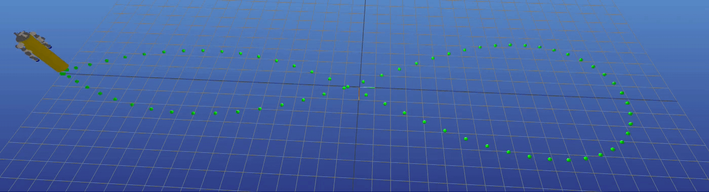
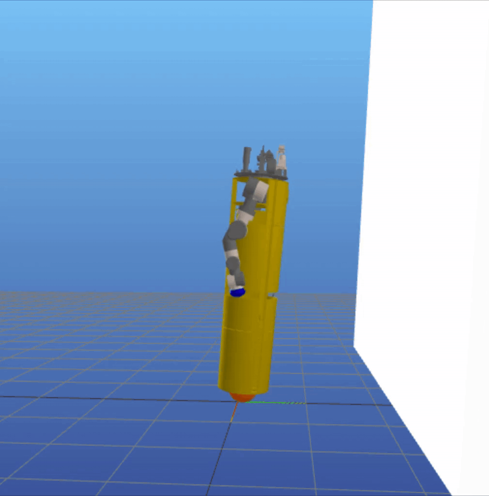
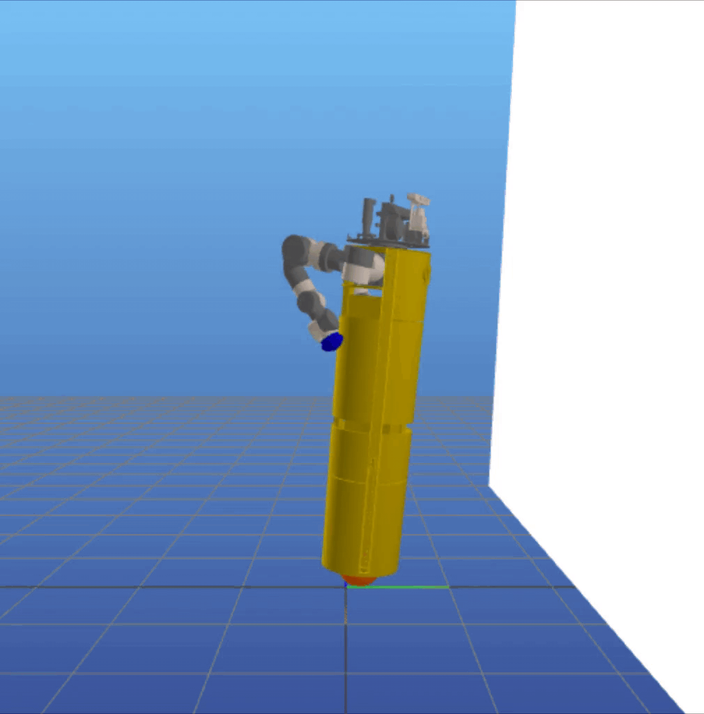
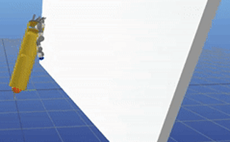

# ocrl_ballbot_navigation_project

## Description
Several ballbots have been developed, yet only a handful have been equipped with arms to enhance their maneuverability and manipulability. The incorporation of 7-DOF arms to the CMU ballbot has presented challenges in balancing and navigation due to the constantly changing center of mass. This project aims to propose a control strategy that incorporates the arms dynamics. Our approach is to use a simplified whole-body dynamics model, with only the shoulder and elbow joints moving for each arm. This reduces the number of states and accelerates convergence. We focused on two specific tasks: navigation (straight and curved paths) and pushing a wall. Trajectories were generated using direct collocation for the navigation task and hybrid contact trajectory optimization for pushing the wall. A time-variant linear-quadratic-regulator (TVLQR) was designed to track the trajectories. The resulting trajectories were tracked with a mean-average error of less than 4 cm, even for the more complex path. These experiments represent an initial step towards unlocking the full potential of ballbots in dynamic and interactive environments.

### Objectives:
* Stabilize Ballbot with arms during navigation 
* Achieve faster speed and more agile motion with wall pushing

## Requirements
* Install Julia 1.6.5 https://julialang.org/downloads/

## Tasks
### Navigation without arms task
You can find the code for this task at this link: [Dircol navigation without arms](./dircol_navigation.ipynb).

### Navigation with arms task
You can find the code for this task at this link: [Dircol navigation with arms](./dircol_navigation_arms.ipynb).

### Pushing the wall task
You can find the code for this task at this link: [Hybrid trajectory optimization for pushing the wall](./wall_pushing.ipynb).

Ball speed constrained < 5 m/s | Ball speed constrained < 1 m/s
--- | ---
 | 

### Pushing the wall task with centroidal momentum dynamics (WIP)
You can find the code for this task at this link: [Hybrid trajectory optimization for pushing the wall](./wall_pushing_more_general_reduced.ipynb).
